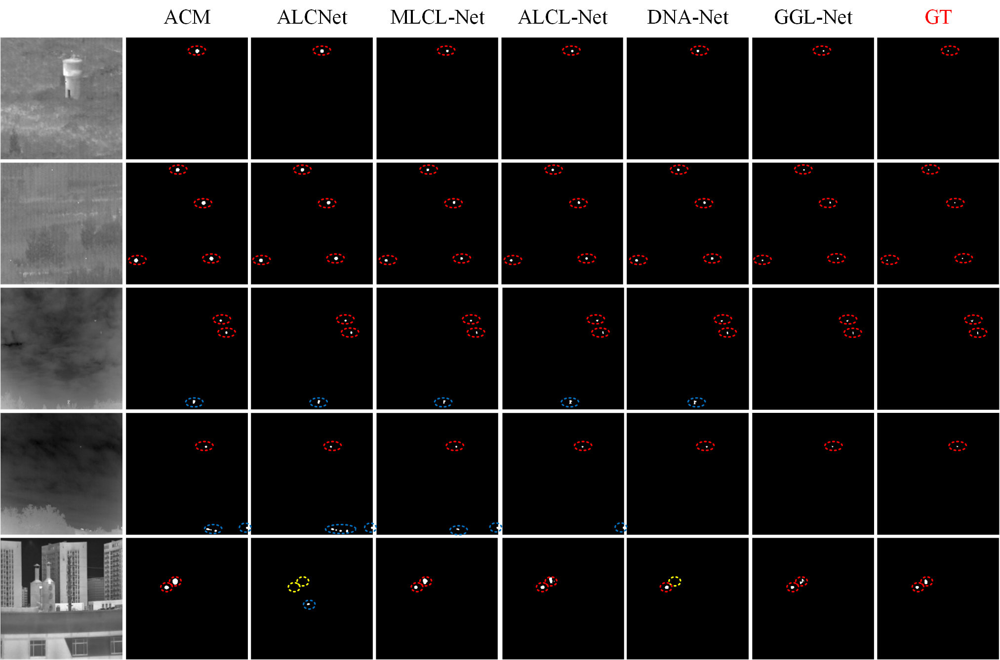

## The official complete code for paper "Refined Infrared Small Target Detection Scheme with Single-Point Supervision" [[Paper/arXiv](https://www.arxiv.org/abs/2408.02773)]  

**The proposed scheme won the *2nd prize* in the "ICPR 2024 Resource-Limited Infrared Small Target Detection Challenge Track 1: Weakly Supervised Infrared Small Target Detection"**  

**This project code is improved based on the [LESPS project code](https://github.com/XinyiYing/LESPS): 1. More IRSTD networks are integrated in this project code. Including [ACM](https://ieeexplore.ieee.org/document/9423171), [ALCNet](https://ieeexplore.ieee.org/document/9314219), [MLCL-Net](https://doi.org/10.1016/j.infrared.2022.104107), [ALCL-Net](https://ieeexplore.ieee.org/document/9785618), [DNANet](https://ieeexplore.ieee.org/document/9864119), [GGL-Net](https://ieeexplore.ieee.org/abstract/document/10230271). 2. A complete set of post-processing (TTA, CRF, AS) strategies are used. 3. The sliding window cropping strategy is used for test samples.**

<p align="center">
  <br>  
  <span align="center">Overall structure of the proposed scheme</span> 
</p>  

## Datasets
The dataset used in this manuscript is the dataset provided by the competition. The dataset includes SIRST-V2, IRSTD-1K, IRDST, NUDT-SIRST NUDT-SIRST-Sea, NUDT-MIRSDT, and Anti-UAV. According to the requirements of the competition organizers, the competition data cannot be made public. The SIRST3 dataset used in the [LESPS framework](https://github.com/XinyiYing/LESPS) can be considered for use. This dataset is public.

## How to use our code
1. Preparing the dataset

   **The dataset production and placement in [LESPS project](https://github.com/XinyiYing/LESPS) can be referenced.**

2. Creat a Anaconda Virtual Environment

    ```
    conda create -n IRSTD-SPS python=3.8 
    conda activate IRSTD-SPS 
    ```

3. Configure the running environment
   
   ```
   pip install opencv-python==4.5.4.60 -i https://pypi.tuna.tsinghua.edu.cn/simple
   pip install opencv-python-headless==4.5.4.60  -i https://pypi.tuna.tsinghua.edu.cn/simple 
   pip install matplotlib -i https://pypi.tuna.tsinghua.edu.cn/simple
   pip install PyWavelets -i https://pypi.tuna.tsinghua.edu.cn/simple
   pip install scikit-image -i https://pypi.tuna.tsinghua.edu.cn/simple
   pip install Pillow -i https://pypi.tuna.tsinghua.edu.cn/simple
   pip install opencv-python==4.5.4.60 -i https://pypi.tuna.tsinghua.edu.cn/simple
   pip install opencv-python-headless==4.5.4.60  -i https://pypi.tuna.tsinghua.edu.cn/simple 
   pip install segmentation-models-pytorch  -i https://pypi.tuna.tsinghua.edu.cn/simple 
   pip install albumentations -i https://pypi.tuna.tsinghua.edu.cn/simple
   pip install cython -i https://pypi.tuna.tsinghua.edu.cn/simple
   conda install -c conda-forge pydensecrf -q -y
    ```
   
4. Training the model  
   
    The default network is GGLNet. If you need to train others, please modify the corresponding network.<br>
    ```
    python train_GGLNet.py
    ```
    
5. Testing the Model  
     
    The default network is GGLNet. If you need to test others, please modify the corresponding network. Notably, this scheme uses the **adjustable sensitivity (AS) strategy**, which has two hyperparameters: "threshold" and "threshold_2". The default settings are for the competition dataset. Appropriate adjustments can be made after changing the dataset. For details, please see [[Paper/arXiv](https://arxiv.org/abs/2407.20090)]. At the same time, "img_norm_cfg_mean" and "img_norm_cfg_std" need to be replaced with the mean and variance of the corresponding dataset. In addition, unlike the original LESPS project, which directly infers the entire image, this project will slide and crop the test sample according to the set hyperparameters "patchSize". This setting is mainly for the large size of some samples in the competition. For the SIRST3 dataset, it can be set to 2048 to ensure that the entire image is tested directly. Furthermore, please remember to change the final weight path.

    ```
    python test_MSDA_Net.py
    ```
    
6. Performance Evaluation
   
   In the "true_mask" folder of the main project, please put the true label.
   
    ```
    python cal_mIoU_and_nIoU.py
    python cal_Pd_and_Fa.py
    ```
    
## Results
* **Quantative Results on Competition Dataset**:
  
<p align="center">
  </br>
  <span align="center">The GGL-Net with LESPS framework has significantly excellent performance in this task.</span> 
</p>


* **Qualitative results on Competition Dataset**:
  
<p align="center">
  
</p>

* **More results on Competition Dataset**:
  
  For more results on Competition Dataset, please refer to the paper [[Paper/arXiv](https://www.arxiv.org/abs/2408.02773)]. 


## Citation

Please cite our paper in your publications if our work helps your research. <br>
BibTeX reference is as follows:
```
@misc{zhao2024refinedinfraredsmalltarget,
      title={Refined Infrared Small Target Detection Scheme with Single-Point Supervision}, 
      author={Jinmiao Zhao and Zelin Shi and Chuang Yu and Yunpeng Liu},
      year={2024},
      eprint={2408.02773},
      archivePrefix={arXiv},
      primaryClass={cs.CV},
      url={https://arxiv.org/abs/2408.02773}, 
}
}
```

word reference is as follows:
```
Jinmiao Zhao, Zelin Shi, Chuang Yu, and Yunpeng Liu. Refined Infrared Small Target Detection Scheme with Single-Point Supervision. arXiv preprint arXiv:2408.02773, 2024.
```

## Other link
1. My homepage: [[YuChuang](https://github.com/YuChuang1205)]
2. "MSDA-Net" demo: [[Link](https://github.com/YuChuang1205/MSDA-Net)]
3. "LR-Net" demo: [[Link](https://github.com/YuChuang1205/LR-Net)]
4. "PAL Framework" demo：[[Link](https://github.com/YuChuang1205/PAL)]

 --- 
### _!!! Update (2024-12-18): Our latest research work: the Progressive Active Learning (PAL) framework for infrared small target detection with single point supervision has been open sourced [[paper](https://arxiv.org/abs/2412.11154)][[code](https://github.com/YuChuang1205/PAL)]. Compared to the LESPS framework, The proposed PAL framework has significantly better and stable performance. For details, please see [[paper](https://arxiv.org/abs/2412.11154)]. In addition, the public project code of the PAL framework integrate more networks, more label formats, and more datasets. [Everyone is welcome to use it](https://github.com/YuChuang1205/PAL)._
 --- 

